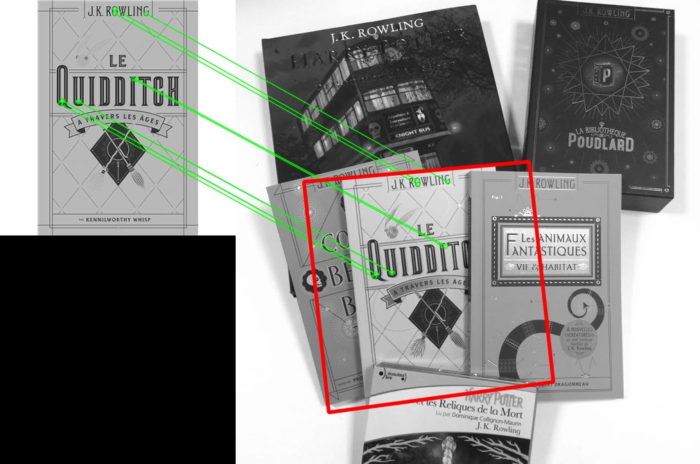
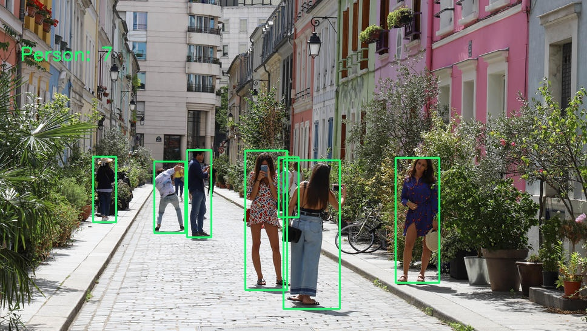

# Object-Detection
Assignement 1: Object Detection

## Installation

```bash
$ pip install requirement.txt
```

For Github Users only:
Since Github doesn't allow file over 100Mb, download the weights file following this link: https://pjreddie.com/media/files/yolov3.weights
Once the file is downloaded, place it into the directory containing the executable.
## Usage

```bash
python problem1.py
```


```bash
python problem2.py
```

